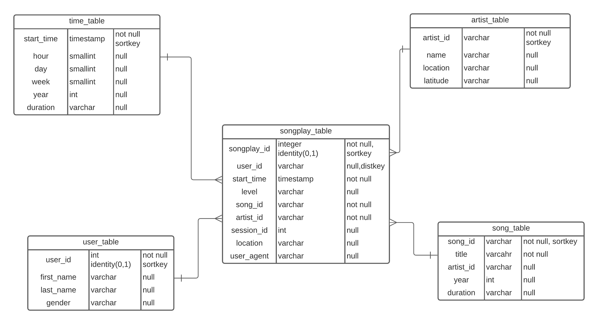

<h1>Sparkify Music Data Warehouse in AWS Redshift </h1>

This project is a part of the Udacity nanodegree in data engineering curriculum
Sparkify is a music streaming startup which has grown their user base and song database and want to move their processes and data onto the AWS cloud for better performance.he dataset resides in S3, in a directory of JSON logs on users activity on the app, as well as directory with JSON metadata on the songs in their apps.

As an data engineer, we built an ETL pipeline that extracts their data from S3, then stages them in AWS Redshift and transforms the data into set of dimensional tables for the analytics team to continue finding insights in what songs thier users are listening to. 
    

    
<h2>Project Dataset</h2> 

We used the dataset provided by the Udacity that reside in the AWS S3 with the following  links 

<ul>
    <li><strong>Song data:</strong> s3://udacity-dend/song_data</li>
    <li><strong>Log data:</strong> s3://udacity-dend/log_data</li>
    
</ul>

The first dataset is a subset of real data from the Million Song Dataset. Each file is in JSON format and contains metadata about a song and the artist of that song. The files are partitioned by the first three letters of each song's track ID.    
    

<h2>Schema for the Song Play Analysis </h2>

<h3>Fact Table </h3>
<ol>
    <li><strong>songplays</strong> - records in event data associated with song plays i.e. records with page NextSong 
        <ul><li>songplay_id, start_time, user_id, level, song_id, artist_id, session_id, location, user_agent </li></ul>
</ol>

<h3>Dimension Tables </h3>
<ol>
    <li><strong>users</strong> - users in the app</li>
 <ul><li>user_id, first_name, last_name, gender, level</li></ul>
    <li><strong>songs</strong> - songs in music database</li>
<ul><li>song_id, title, artist_id, year, duration</li></ul>
    <li><strong>artists</strong> - artists in music database</li>
<ul><li>artist_id, name, location, lattitude, longitude</li></ul>
    <li><strong>time</strong> - timestamps of records in songplays broken down into specific units</li>
<ul><li>start_time, hour, day, week, month, year, weekday</li></ul>
</ol>

<h2>Project Template </h2>

In this repository, the workspace contains the following files and its description

<ul>
    <li><strong>create_table.py</strong>This is the python script file which creates the fact and dimension tables for the star schema in AWS Redshift</li>
    <li><strong>etl.py </strong> This is the python script file that will load the json cluster files from S3 into the staging tables on AWS Redshift and then process that data into the anlytics tables on the AWS Redshift</li>
<li><strong>sql_queries.py</strong> This is where we define the SQL statements which will be imported into the  two files above</li> 
</ul>   

<h2>Steps followed for the Data Warehouse Setup:</h2>
<h3>Create table Schema: </h3>
<ul>
    <li>Designed the Star schema for the fact and dimensions table </li>
    <li>Wrote the SQL queries for CREATE and DROP in the sql_queries.py files </li>
    <li>Used the create_table.py sile to connect to the database and create the tables </li>
    <li>Launched the redshift cluster and created the the IAM role that can read access to S3 </li>
    <li>Added the redshift database and IAM role info in the dwh.cfg file</li>
    <li> Run the scripts</li>
</ul>    

<h3>Build ETL Pipeline in python: </h3>
<ul>
    <li>Implemented the logic in the etl.py file to load the dataset from s3 to staging tables on the Redshift</li>
    <li>Implemented the logic in the etl.py file to load the dataset from staging tables to analytics table on the Redshift </li>
    </ul>    

<h2>Optimization in the redshift table's distribution style</h2>

When we load the data into the table, AWS Redshift distributes the rows of the tables to each of the compute nodes according to the tabledistribution style. When we run a query the query optimizer redistributes the rows to the compute nodes as needed to perform any joins and aggregations

When we create a create we can designate one of the four distributonstyles: <strong> AUTO,EVEN,KEY,ALL</strong> In this create statement of the final tables we used DISTKEY and SORTKEY. Sortkey is the keyword that specifies that the column is the sort key in the tables. When the data is loaded into the tables, the data is sorted by one or more columns that are designeated as sortkey
    

Similarily for the second key i.e DISTKEY, it specifies that the column to be used as the distribution key for the table. we can use the DICTKEY after the column name or as a nmae table definition
    
    
